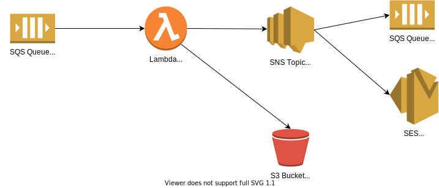
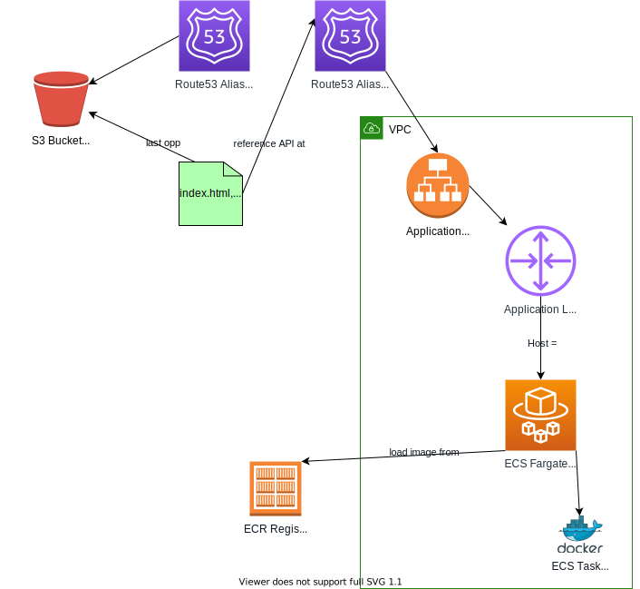

# AWS CDK IaC repo for Capra Konsulentskolen del 2

Dette repoet kan `clone`s for å lage ressurser i Amazon Web Services (AWS) med Cloud Development Kit (CDK).  
Prinsippet er Infrastructure as Code (IaC), som også finnes som f.eks. CloudFormation yaml, Terraform og Pulumi osv...

## Load balancer

Det finnes en felles, ferdig oppdatt ALB
på [Share-LoadB-1LDQS1T6W6ZW0-1701426986.eu-west-1.elb.amazonaws.com](http://Share-LoadB-1LDQS1T6W6ZW0-1701426986.eu-west-1.elb.amazonaws.com)

## Filer

* [cdk.json](./cdk.json) sier hvordan CDK Toolkit skal kjøre din "app" (infrastruktur-kode).
* [cdk.context.json](./cdk.context.json) er en cache av AWS-kontoen vi bruker.
* [package.json](./package.json) lister dependencies og kommandoer for `npm`.
* [tsconfig.jso](./tsconfig.json), [.prettierrc.json](./.prettierrc.json), [.eslintrc.js](./.eslintrc.js) er configs for
  bygg og lint.
* [bin/cdk-app.ts](./bin/cdk-app.ts) er "main entrypoint" for CDK. Denne sier hvilke Stacks som skal deployes og i
  hvilken AWS konto.
  * Her "constructer" du inn dine stacks (`new MyStack()`), hvis du har fler enn 1. For eksempel to uavhengige
    applikasjoner.
  * Det er også her du kobler dependencies mellom stacks sammen, via props:
    ```typescript
    const myQueueStack = new MyQueueStack(...)
    new MyAppStack(..., { queue: myQueueStack.sqsQueue })
    ```
* [lib/stacks/my-cool-aws-stack.ts](./lib/stacks/my-cool-aws-stack.ts) en tom stack. Her kan du legge inn din egen kode
  for å opprette en ECS Fargate service, Lambda, SQS, S3 bucket osv.
  * En stack er en samling med constructs som skal deployes.
  * En construct er en gjennbrukbar komponent, som består av flere construcs eller aws-ressurser.
* [lib/config.ts](./lib/config.ts) Instillinger for IaC. **Her skal du legge inn navnet ditt** så din stack ikke
  kolliderer med andre studenter.

## Oppsett av aws-vault

Legg til følgene i filen `~/.aws/config`

```
[profile ks2]
mfa_serial=arn:aws:iam::701519849458:mfa/konsulent
region=eu-west-1
```

Og kjør `aws-vault add ks2`  
Bruk credentials fra Lastpass: `Shared-Student-Workshop/` `amazon.com KS2 konsulent`.  
Kristian har tilgang til den.

## Nyttige kommandoer

* `npm run build`   compile typescript to js
* `npm run watch`   watch for changes and compile
* `npm run test`    perform the jest unit tests
* `npm run lint`    run lint to find mistakes


* `npm run cdk deploy`                                deploy this stack to your default AWS account/region
* `npm run cdk synth`                                 emits the synthesized CloudFormation template
* `npm run cdk ls`                                    view stacks
* `aws-vault exec ks2 -- npm run cdk diff`            compare deployed stack with current state
* `aws-vault exec ks2 -- npm run cdk diff <stack>`
* `aws-vault exec ks2 -- npm run cdk deploy -- --all` deploy everything
* `aws-vault exec ks2 -- npm run cdk destroy <stack>` remove a stack

* `aws-vault login ks2` open the AWS console

# Ressurser

- Slides, AWS https://docs.google.com/presentation/d/116vsojmw7ca3_72yPTnYaVveGYqhRdHW7OGAzAGtRm0/edit?usp=sharing
- Slides, IaC https://docs.google.com/presentation/d/1G2JG5k0OweObcymyH4EvTzNG9Kp8RJChe5NPP_mAi7M/edit#slide=id.p
- CDK tutorial https://docs.aws.amazon.com/cdk/v2/guide/getting_started.html#hello_world_tutorial
- Your first cdk stack https://docs.aws.amazon.com/cdk/v2/guide/hello_world.html
- Referanse-repo https://github.com/aleksil/ctfd-cdk-example/tree/master/src
- how-to https://docs.aws.amazon.com/cdk/v2/guide/how_tos.html
- API reference https://docs.aws.amazon.com/cdk/api/v2/docs/aws-construct-library.html

## Forslag til infrastruktur du kan lage

### Lambda SQS processor



### Webapp backend



---

# Hvordan dette ble satt opp

1. Lagde prosjektet fra `npx aws-cdk init app --language=typescript`
2. Importerte til IntelliJ fra "existing sources"
3. Genererte `.gitignore` på https://www.toptal.com/developers/gitignore/api/macos,linux,windows,node
4. La inn noe ekstra i `.gitignore` for cdk
5. La inn en ressurs i [sommerstudent-konsulentskolen-aws-template-stack.ts](lib/stacks/my-cool-aws-stack.ts)
6. Installer og sett opp Prettier, ESlint (`npx eslint --init`), la inn prettier config til eslint
7. La inn `config.ts` og `tags.ts` fra aleksi, og tok de i bruk.
8. Pekte ts output til `out/`
9. La inn aws konto i aws-vault, og pekte den til eu-west-1.
10. `aws-vault exec ks2 -- npx cdk bootstrap aws://701519849458/eu-west-1`
  1. Denne lager en CloudFormation stack: `CDKToolkit`.
11. La inn felles infra som vpc, alb og en stack som henter de via SSM parametre
12. `aws-vault exec ks2 -- npm run cdk deploy` med `SharedInfraStack` i app
13. Byttet `dittNavn` fra `capra` til `kristian` og prøvde `aws-vault exec ks2 -- npm run cdk synth`
14. 